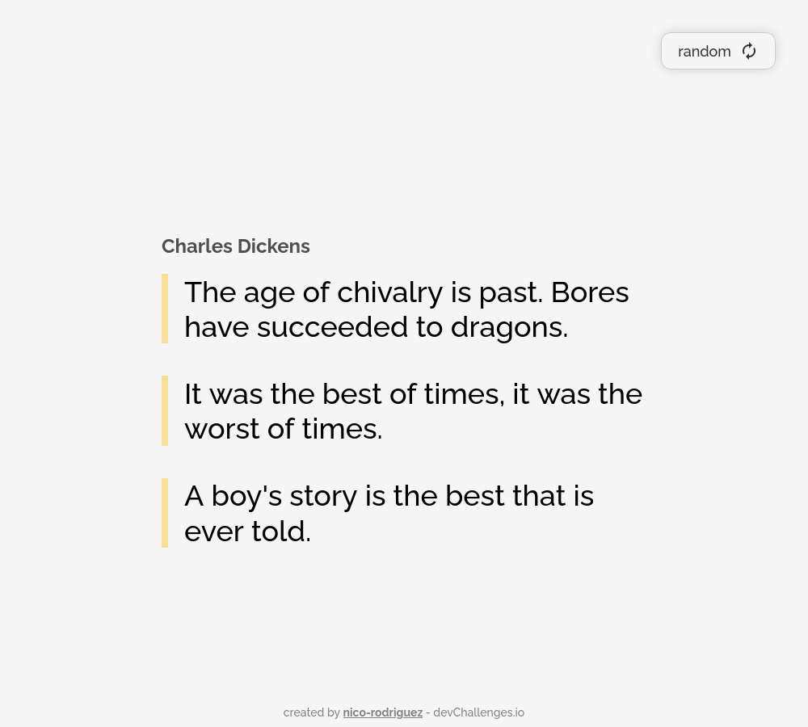
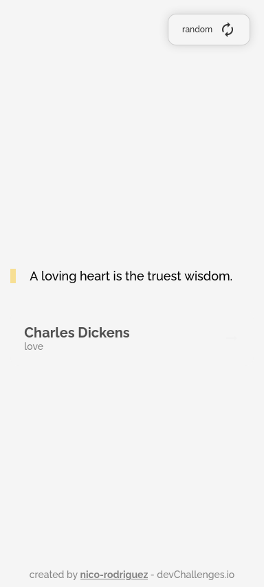
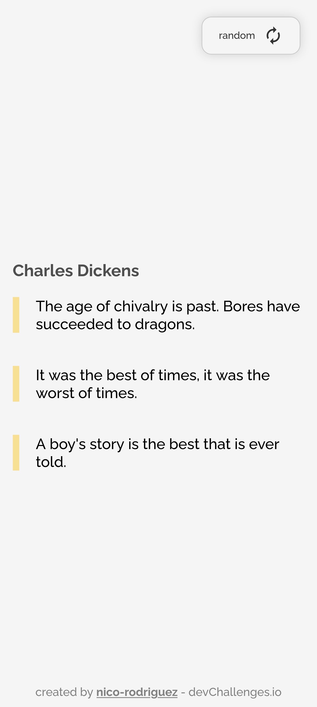

<h1 align="center">Quote Generator</h1>

   Solution for a challenge from  <a href="http://devchallenges.io" target="_blank">Devchallenges.io</a>.

  <h3>
    <a href="https://quote-generator-a1e073.netlify.app/">
      Solution
    </a>
     | 
    <a href="https://devchallenges.io/challenges/8Y3J4ucAMQpSnYTwwWW8">
      Challenge
    </a>
  </h3>

## Overview

Visit [https://quote-generator-a1e073.netlify.app/](https://quote-generator-a1e073.netlify.app/).

Desktop

Mobile

## Features

This application/site was created as a submission to a [DevChallenges](https://devchallenges.io/challenges) challenge. The [challenge](https://devchallenges.io/challenges/8Y3J4ucAMQpSnYTwwWW8) was to build an application to complete the given user stories.

At the first load, the script `fetchRandomQuotes.js` fetches 40 random quotes. It does so asynchronously to the page loading, thanks to the `async` attribute of the `script` tag.

The button for fetching a random quote has an animated icon. 40 new random quotes are fetched after the user clicks the button 40 times.

The application is optimized for slow connections. When fetching a new batch of random quotes, it may fetch a single random quote if the batch did not arrive at the moment of updating the UI. If there's a batch available, the random quotes are taken from it, which makes for a faster interaction and better UX.

## Acknowledgment

The API used for the quotes: [https://pprathameshmore.github.io/QuoteGarden/](https://pprathameshmore.github.io/QuoteGarden/).
